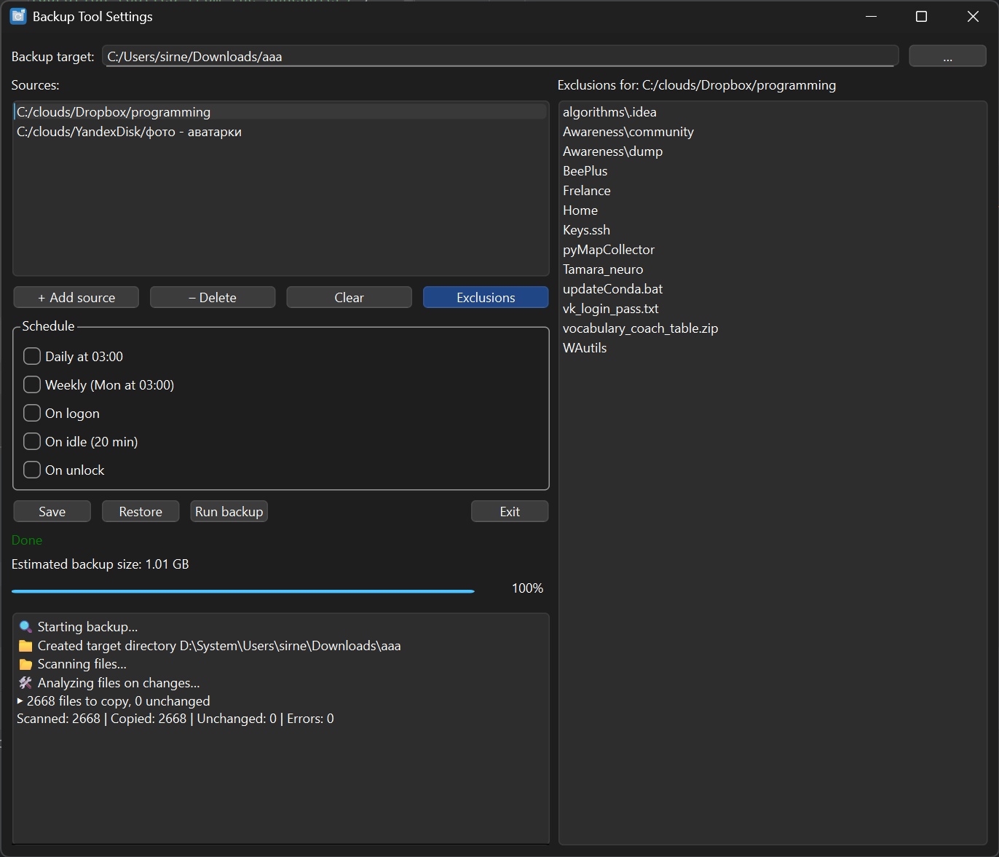
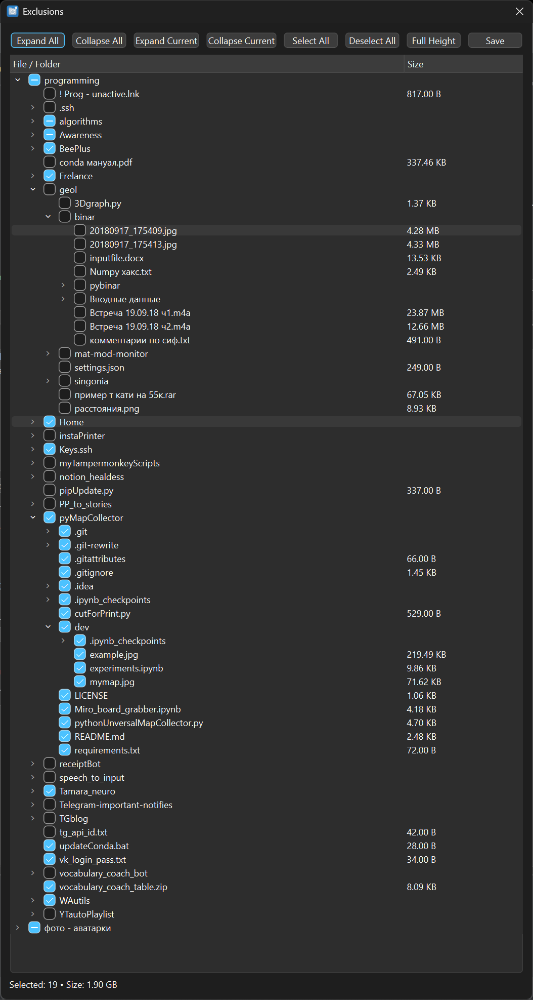
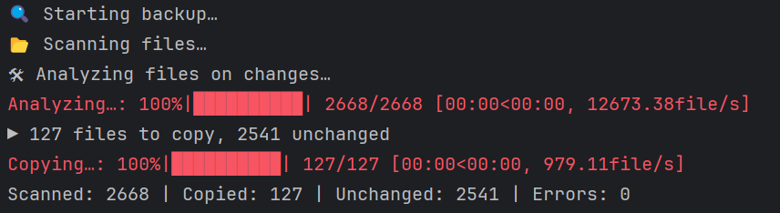

# Windows Backup Tool

A compact backup utility to mirror selected folders (e.g., `%AppData%`) into a target directory on Windows.  
It performs incremental copies, supports exclusions, scheduling, and offers a simple GUI.

> **Why?**  
> I created this tool to ensure that all my game and application save/config files on my GPD Win are backed up to an SD
> card, excluding unnecessary program folders.  
> Many utilities copy everything blindly or create massive snapshots. Applications can be reinstalled easily; your save
> files and settings are what matter.  
> Moreover, `%AppData%` has become cluttered with junk from Electron apps. This tool lets you **precisely** copy only
> useful files.

<p align="center">
  
</p>

## Features

- **Absolute-path mirroring**  
  Preserves original folder structure under the target (e.g., `C:\Users\Foo\AppData\…` →
  `Backup\C\Users\Foo\AppData\…`).
- **Incremental copies**  
  Skips unchanged files (by size & timestamp, with optional SHA‑1 checksum).
- **Exclusion dialog**  
  Easily select which folders/files to include or exclude.
- **Live size estimate**  
  Dynamically shows the estimated backup size after applying exclusions.
- **Scheduler integration**  
  Create Windows Task Scheduler triggers: Daily, Weekly, On Logon, On Idle, On Unlock.
- **Multi‑threaded**  
  Concurrent file copying for speed.
- **Progress & logging**  
  Real‑time progress bar and detailed logs.
- **Background preferences**  
  Decide whether to show the console progress window or close immediately, and monitor the time of the last successful backup directly in the GUI.
- **Zero‑install**  
  Just run the `.exe` or Python script—no installer needed.

<div align="center">
  <br>
  <em>Dialog for excluding folders and files</em>
</div>

## Quick Start

1. **Install dependencies**
   ```bash
   pip install -r requirements.txt
   ```
2. **Launch GUI**
   ```bash
   python main.py
   ```
   - If no flags are passed, the GUI will be launched. Admin rights will be requested if needed.
   - Choose **Backup Target** and **Source** folders.
   - Configure **Exclusions** via the tree view.
   - Select **Schedule** triggers and click **Save**.

Settings are saved to `%AppData%\BackupTool\config.json`.

## CLI Mode

Run a backup using saved settings (for Task Scheduler or scripts):

```bash
python main.py --backup
```

Launch GUI with a visible console window (for debugging):

```bash
python main.py --dev
```

> Note: SHA‑1 verification is supported internally but not exposed in the interface yet.

<p align="center">
  
</p>

## Scheduling

When you click **Save**, scheduled tasks are created/removed in Task Scheduler under the `BackupTool` folder:

- **Daily** @ 03:00
- **Weekly** (Mon @ 03:00)
- **On Logon**
- **On Idle** (20 min)
- **On Unlock**

You can toggle these options in the GUI at any time.

## Localization

Translations are managed with Babel.  
To update:

```powershell
./update_translations.ps1
```

- `locales/app.pot`: template
- `locales/<lang>/LC_MESSAGES/*.po/.mo`: language files

> Qt interface is localized only when the system language is Russian (`LANG=ru_*`)

## Building Executable

Generate a standalone `.exe`:

```bash
pyinstaller --onefile --uac-admin --name BackupTool --add-data "locales;locales" --add-data "icon;icon" --icon icon/icon.ico main.py
```

> `--uac-admin`: requests elevated privileges when launched  
> Result is saved in `dist/BackupTool.exe`.

## Logs

- **No persistent log file**; monitor progress and messages in the GUI log window or console output
- **`backup_errors_YYYYMMDD_HHMMSS.log`** is saved to Desktop if errors occur

## Development

To modify or extend the application:

- **Configuration storage** is in `%APPDATA%\BackupTool\config.json`. Models and serialization logic are defined in
  `src/config.py`.
- **Backup logic** is implemented in `src/copier.py`. To add new behaviors (e.g., checksum algorithms, custom filters),
  update the `run_backup()` function.
- **GUI components** reside in `src/gui/`:
    - `MainWindow.py` manages the main settings window and triggers.
    - `ExcludeDialog.py` handles exclusion tree and size calculation.
    - `SizeWorker.py` computes backup size in background.
- **Scheduling** lives in `src/scheduler.py`. Extend the `TASKS` dict and add corresponding checkboxes in
  `MainWindow._build_ui()` to support new triggers.
- **Localization** uses Babel and gettext. Wrap strings with `_()`. Update translations via `./update_translations.ps1`
  and edit `.po` files under `locales/`.
- **Executable build** relies on PyInstaller. The spec command is shown above.
- **Dependencies** are maintained in `requirements.txt`. Install with `pip install -r requirements.txt`.

Contributions, bug reports and feature requests are welcome via GitHub issues or pull requests.
