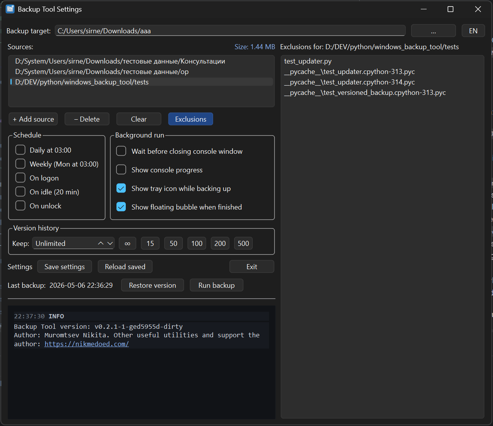
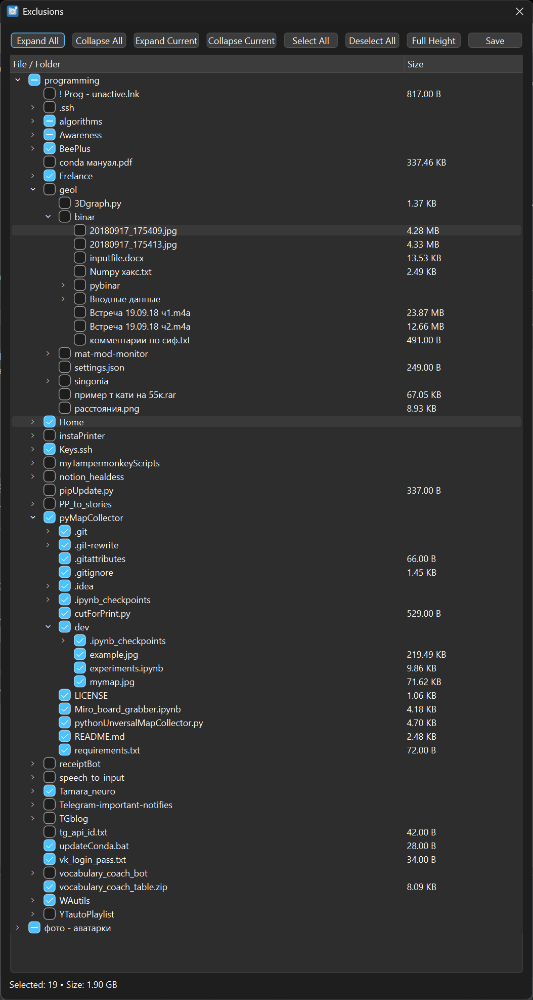
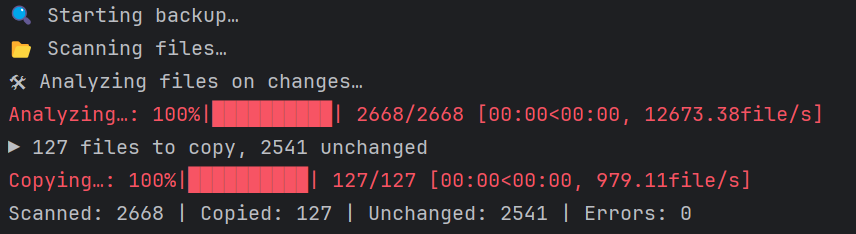

# Windows Backup Tool

A compact backup utility to mirror selected folders (e.g., `%AppData%`) into a target directory on Windows.  
It performs incremental copies, supports exclusions, scheduling, and offers a simple GUI.

> **Why?**  
> I created this tool to ensure that all my game and application save/config files on my GPD Win are backed up to an SD
> card, excluding unnecessary program folders.  
> Many utilities copy everything blindly or create massive snapshots. Applications can be reinstalled easily; your save
> files and settings are what matter.  
> Moreover, `%AppData%` has become cluttered with junk from Electron apps. This tool lets you **precisely** copy only
> useful files.

<p align="center">
  
</p>

## Features

- **Absolute-path mirroring**  
  Preserves original folder structure under the target (e.g., `C:\Users\Foo\AppData\…` →
  `Backup\C\Users\Foo\AppData\…`).
- **Incremental copies**  
  Skips unchanged files by comparing content with SHA‑1, avoiding timestamp drift false positives.
- **Version history**  
  Keeps the latest backup as a plain mirror and stores older file versions under `.backup_versions`.
- **Retention for old versions**
  Optionally keeps only the latest N successful backup versions and removes archive files no remaining version needs.
- **Restore from versions**  
  Restore a folder or a single file to original paths, or export a selected version to another folder.
- **Exclusion dialog**  
  Easily select which folders/files to include or exclude.
- **Live size estimate**  
  Dynamically shows the estimated backup size after applying exclusions.
- **Scheduler integration**  
  Create Windows Task Scheduler triggers: Daily, Weekly, On Logon, On Idle, On Unlock.
- **Multi‑threaded**  
  Concurrent file copying for speed.
- **Progress & logging**  
  Real‑time progress bar and detailed logs.
- **Background preferences**  
  Decide whether to show the console progress window or close immediately, and monitor the time of the last successful backup directly in the GUI.
- **Quiet tray indicator**  
  Optional spinner in the Windows tray while scheduled backups run silently, so games stay fullscreen without stray consoles.
- **Floating overlay**  
  A small translucent bubble can pop up (configurable) when backups finish, providing feedback without minimizing full-screen apps.
- **Automatic executable updates**  
  Frozen `.exe` builds quietly check GitHub Releases in the background and replace themselves after the current app process exits.
- **Zero‑install**  
  Just run the `.exe` or Python script—no installer needed.

<div align="center">
  <br>
  <em>Dialog for excluding folders and files</em>
</div>

## Quick Start

1. **Install dependencies**
   ```bash
   pip install -r requirements.txt
   ```
2. **Launch GUI**
   ```bash
   python main.py
   ```
   - If no flags are passed, the GUI will be launched. Admin rights will be requested if needed.
   - Choose **Backup Target** and **Source** folders.
   - Configure **Exclusions** via the tree view.
   - Select **Schedule** triggers and click **Save**.

Settings are saved to `%AppData%\BackupTool\config.json`.

## Versioned Backups

The target directory still contains a direct mirror of the latest backup:

```text
BackupTarget\C\Users\Foo\AppData\...
```

That latest mirror can still be restored manually by copying files back.
When a backed-up file changes or disappears from the source, the previous
mirror copy is moved into a date-named version archive:

```text
BackupTarget\.backup_versions\files\YYYYMMDD_HHMMSS_run_N\C\Users\Foo\...
BackupTarget\.backup_versions\index.sqlite3
```

If the target already contains a matching plain mirror but no version index yet,
the next run records one baseline version for that mirror. Later runs with no
file changes do not create extra versions.

If the backup target is inside one of the configured source folders, the target
subtree is skipped automatically so the backup does not copy itself.

The GUI setting **Keep backup versions** can limit stored history. `Unlimited`
keeps the previous behavior. When a limit is set, old successful versions are
collapsed into the next remaining version first, then archive files that are no
longer referenced by any remaining version are removed. The latest mirror is not
deleted by retention.

The GUI **Restore** action starts from a selected backup version and the
configured sources. For original locations, it shows a diff between that
version and the current files before anything is applied. Original-path restore
applies only that patch: create, replace, or delete, and each action can be
enabled or disabled with a checkbox. Before original-path restore overwrites or
deletes an existing file, it saves that current file under
`.backup_versions\restore_safety`. Restore changes only the original files; it
does not update the latest mirror and does not create a backup version.
The mirror is updated later by the next scheduled or manual backup run.
If a backup run finds no changes, it also does not create an extra version.

When restoring to a separate folder, the tool does not patch or touch original
files. It exports the full selected version for the configured sources using the same
absolute-path mirror layout as normal backups, for example:

```text
OutputFolder\C\Users\Foo\AppData\...
```

## CLI Mode

Run a backup using saved settings (for Task Scheduler or scripts):

```bash
python main.py --backup
```

Create a traversal debug log on the Desktop (timestamped) to inspect which
folders are entered or skipped:

```bash
python main.py --backup --debug
```

When running the GUI, the same flag enables debug logging for the **Run backup**
button (log is created when the backup starts):

```bash
python main.py --debug
```

Optionally provide a custom log path:

```bash
python main.py --backup --debug "D:\logs\backup_debug.txt"
```

If the **Show console progress** option is disabled, you can enable **Show tray icon while backing up** in the GUI.  
This keeps scheduled runs completely silent and instead displays a temporary tray spinner that disappears when the job finishes.  
To also get a subtle success/error hint, enable **Show floating bubble when finished**—it fades in/out above other windows without stealing focus.

Launch GUI with a visible console window (for debugging):

```bash
python main.py --dev
```

## Automatic Updates

Standalone `.exe` builds check the latest release at:

```text
https://github.com/nikmedoed/windows_backup_tool/releases/latest
```

The updater is intentionally quiet:

- it runs only for frozen Windows executables, not during normal `python main.py` development runs;
- it checks at most once every 12 hours, with a shorter retry backoff after network errors;
- it downloads the `BackupTool.exe` release asset in a detached helper process, so GUI and scheduled `--backup` runs are not delayed;
- it keeps the downloaded update under `%APPDATA%\BackupTool\updates`;
- it replaces the running executable only after the parent process exits, because Windows locks active `.exe` files;
- if replacement fails because another instance is still running, the staged update remains and is retried on a later launch.

> Note: Backup change detection stores SHA‑1 hashes in the version index. Normal
> no-change runs compare the source file with the indexed hash instead of
> reading both the source and mirror copies.

<p align="center">
  
</p>

## Scheduling

When you click **Save**, scheduled tasks are created/removed in Task Scheduler under the `BackupTool` folder:

- **Daily** @ 03:00
- **Weekly** (Mon @ 03:00)
- **On Logon**
- **On Idle** (20 min)
- **On Unlock**

You can toggle these options in the GUI at any time.

## Localization

Translations are managed with Babel.  
To update:

```powershell
./update_translations.ps1
```

- `locales/app.pot`: template
- `locales/<lang>/LC_MESSAGES/*.po/.mo`: language files

> Qt interface is localized only when the system language is Russian (`LANG=ru_*`)

## Building Executable

Generate a standalone `.exe`:

```bash
python scripts/write_version.py --print
pyinstaller BackupTool.spec --noconfirm
```

> `--uac-admin`: requests elevated privileges when launched  
> Result is saved in `dist/BackupTool.exe`.
> The build writes `src/_version_generated.py` from `git describe --tags --dirty --always`, so the frozen executable carries the tag-derived version even when it later runs outside a git checkout.

## Release Build

Pushing a version tag starts the GitHub Actions release workflow:

```powershell
git tag v0.2.2
git push origin v0.2.2
```

The workflow builds `BackupTool.exe` on `windows-latest`, uploads it as a workflow artifact, and attaches it to the GitHub Release for that tag. The release asset name stays `BackupTool.exe`, which is what the automatic updater downloads.

## Logs

- **No persistent log file**; monitor progress and messages in the GUI log window or console output
- **`backup_errors_YYYYMMDD_HHMMSS.log`** is saved to Desktop if errors occur

## Development

To modify or extend the application:

- **Configuration storage** is in `%APPDATA%\BackupTool\config.json`. Models and serialization logic are defined in
  `src/config.py`.
- **Backup logic** is implemented in `src/copier.py`. To add new behaviors (e.g., checksum algorithms, custom filters),
  update the `run_backup()` function.
- **GUI components** reside in `src/gui/`:
    - `MainWindow.py` manages the main settings window and triggers.
    - `ExcludeDialog.py` handles exclusion tree and size calculation.
    - `SizeWorker.py` computes backup size in background.
- **Scheduling** lives in `src/scheduler.py`. Extend the `TASKS` dict and add corresponding checkboxes in
  `MainWindow._build_ui()` to support new triggers.
- **Localization** uses Babel and gettext. Wrap strings with `_()`. Update translations via `./update_translations.ps1`
  and edit `.po` files under `locales/`.
- **Executable build** relies on PyInstaller. The spec command is shown above.
- **Dependencies** are maintained in `requirements.txt`. Install with `pip install -r requirements.txt`.

Contributions, bug reports and feature requests are welcome via GitHub issues or pull requests.
